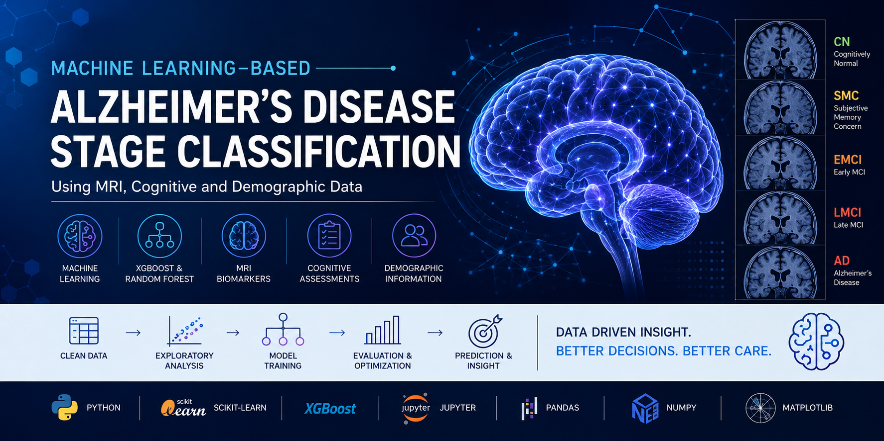

<p align="center">
  
</p>

# Machine Learning-Based Alzheimer's Disease Stage Classification Using MRI, Cognitive and Demographic Data


## Project Overview

This project investigates the use of machine learning techniques for the multi-class classification of Alzheimer's disease stages using MRI-derived measurements, cognitive assessment scores, demographic information, and clinical features. The objective is to develop predictive models that can assist clinicians in identifying different stages of Alzheimer's disease through data-driven decision support.

Two ensemble learning algorithms, **Random Forest** and **Extreme Gradient Boosting (XGBoost)**, were developed and compared using a comprehensive machine learning pipeline consisting of data preprocessing, feature engineering, model training, hyperparameter optimisation, and performance evaluation.

---

## Key Features

- Data cleaning and preprocessing
- Missing value imputation
- Feature encoding and scaling
- Exploratory Data Analysis (EDA)
- Feature selection
- Random Forest classifier
- XGBoost classifier
- Hyperparameter tuning using GridSearchCV
- Stratified Cross Validation
- Multi-class classification
- ROC Curve analysis
- Precision-Recall Curve analysis
- Performance comparison between models

---

## Repository Structure

```
Alzheimer-Disease-Classification/
│
├── data/
│   ├── raw/
│   └── processed/
│
├── notebooks/
│   ├── ML_Alzheimer_EDA.ipynb
│   └── Alzheimer's Disease_Code.ipynb
│
├── reports/
│   └── Alzheimer_Disease_Classification_Report.pdf
│
├── results/
│
├── images/
│
├── models/
│
├── requirements.txt
├── README.md
└── LICENSE
```

---

## Dataset

This project uses a subset of the **Alzheimer's Disease Neuroimaging Initiative (ADNI)** dataset prepared for the **TADPOLE Grand Challenge**.

The original dataset is **not included** in this repository due to licensing and redistribution restrictions.

Please refer to `data/raw/DATASET.md` for information on obtaining the dataset from the official sources.

---

## Technologies Used

- Python
- Pandas
- NumPy
- Scikit-learn
- XGBoost
- Matplotlib
- SciPy
- OpenPyXL
- Jupyter Notebook

---

## Machine Learning Workflow

1. Data Collection
2. Data Cleaning
3. Missing Value Imputation
4. Feature Encoding
5. Feature Scaling
6. Exploratory Data Analysis
7. Feature Selection
8. Model Training
9. Hyperparameter Optimisation
10. Model Evaluation
11. Performance Comparison

---

## Models Implemented

### Random Forest

- Ensemble learning method
- Bootstrap aggregation
- Feature importance analysis

### XGBoost

- Gradient boosting decision trees
- Regularisation
- Optimised tree learning
- Hyperparameter tuning

---

## Evaluation Metrics

The models were evaluated using:

- Accuracy
- Precision
- Recall
- F1-score
- ROC Curve
- Area Under the Curve (AUC)
- Precision-Recall Curve
- Cross Validation

---

## Results

The experimental evaluation demonstrated that **XGBoost achieved slightly better overall performance than Random Forest** for Alzheimer's disease stage classification while both models showed competitive predictive capability.

Performance evaluation included:

- Multi-class ROC Curves
- Precision-Recall Curves
- Classification Reports
- Confusion Matrices

---

## Installation

Clone the repository

```bash
git clone https://github.com/YOUR_USERNAME/Alzheimer-Disease-Classification.git
```

Navigate to the project

```bash
cd Alzheimer-Disease-Classification
```

Install dependencies

```bash
pip install -r requirements.txt
```

---

## Usage

Launch Jupyter Notebook

```bash
jupyter notebook
```

Run the notebooks in the following order:

1. `ML_Alzheimer_EDA.ipynb`
2. `Alzheimer's Disease_Code.ipynb`

---

## Future Work

- Deep Learning models (CNNs)
- Explainable AI (SHAP, LIME)
- MRI image-based classification
- Multi-modal learning
- Larger balanced datasets
- External validation using independent datasets

---

## References

- Alzheimer's Disease Neuroimaging Initiative (ADNI)
- TADPOLE Grand Challenge
- Scikit-learn Documentation
- XGBoost Documentation

---

## Author

**Sehrush Seemab Awan**

MSc Big Data Science and Technology

Machine Learning | Data Science | Artificial Intelligence

---

## License

This project is licensed under the MIT License.
